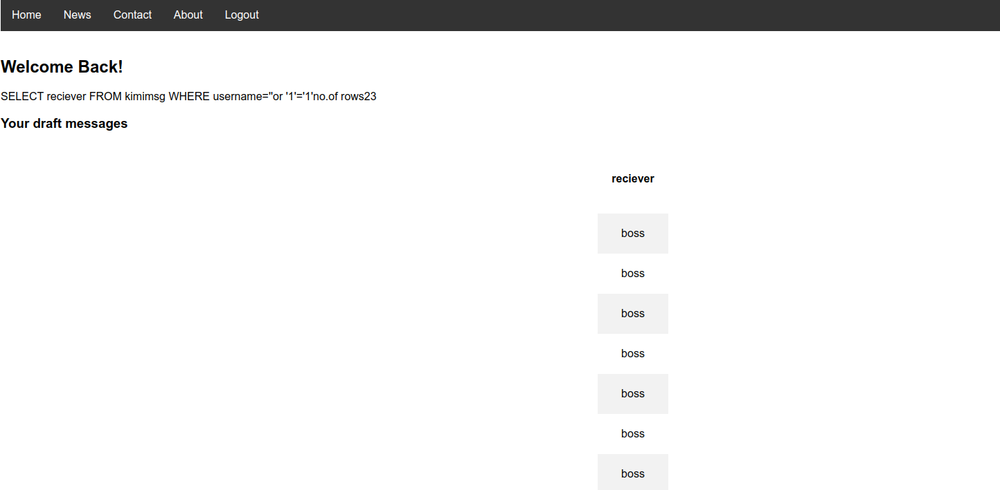
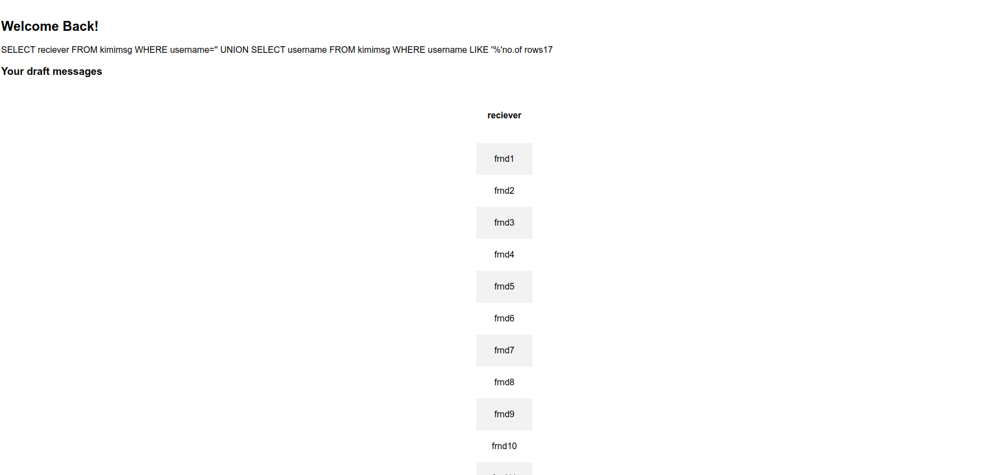
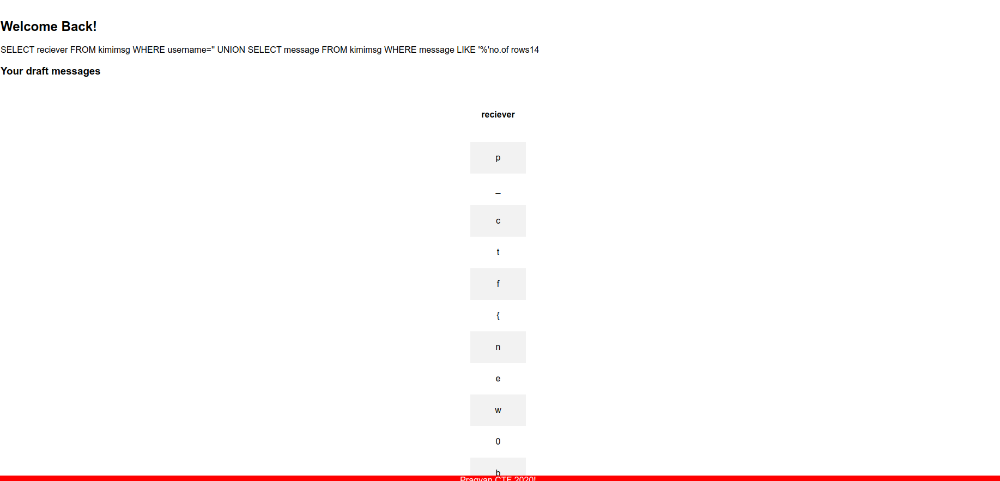

# Kimi No Na Wa

As usual, first tried out SQL injection on the Login field but to no avail.

Register a new user with username as the 'SQL injection payload' and any password
The payload used was `'or'1'='1`
Any simple payload will suffice

On logging in after that the following page was displayed

We observe that all the value from the 'reciever' column are fetched and displayed. The executed query is also visible.

Now a new payload can be designed to display all the usernames from the table. The payload I used was 
`' UNION SELECT username FROM kimimsg WHERE username LIKE '%`
This displays the usernames. Ensure that while crafting the payload, the query returns only a single column.(The php script will only render a single column of data).

Next I tried out various possible column names to print:- msg, messages, message and finally on providing the following payload, got the output with flag.
`' UNION SELECT message FROM kimimsg WHERE message LIKE '%`

The flag is p_ctf{new0b51}
