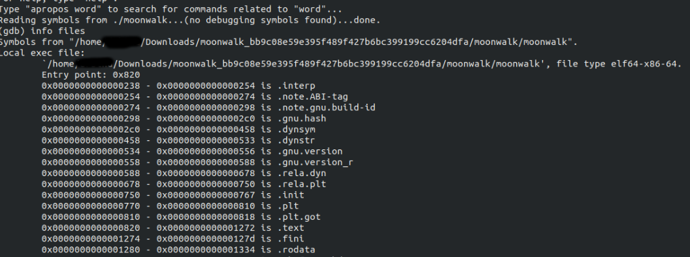
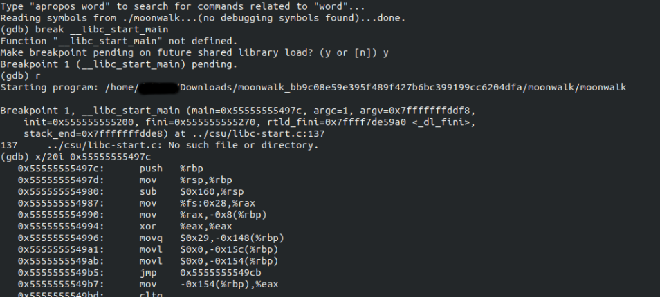

# Moonwalk
After seeing the iconic [Moonwalk](moonwalk), Covid19 wants to use its spike proteins to do the walk on the lung cells of infected people. Could it succeed in this evil endeavor?

# Solution

## Finding main
We first try to decompile it using a decompiler (ghidra, hopper dissassembler) and see that the main function is not directly available. This happens because the entry point address is different in the ELF header.
Refer for more information on [ELF header](https://linux-audit.com/elf-binaries-on-linux-understanding-and-analysis/#structure)

In cases like this we have to find main in order to be able to view the decompiled code.

Refer this [video](https://www.youtube.com/watch?v=N1US3c6CpSw) by LiveOverflow to get a good understanding on how to find main in binaries

On looking through gdb we see that the entry point address is set to start of .text section.


We set a breakpoint on `__libc_start_main`. This function calls the main function. On reaching the breakpoint we get the address of the actual main function. On examining that address we see instructions that could be similar to a main function too.




Now we patch the ELF header to change the entry point address to the value we found. (0x497)
The [patched binary](moonwalk_pathed). This can be patched using any hex editor. We used https://hexed.it/?hl=en . The values to be changed is understood after reading up about the format of the header from the link mentioned above

## Analyzing the code

On decompiling the patched binary we see the main function. After cleaning up some of the code from Ghidra( renaming variables, changing hex to decimal, understanding and replacing with easier logic ). The [raw decopiled code](code_ghidra.c) and [cleaned up code](code_cleaned.c) are both attached for reference on how the cleaning was done.

From the final `printf` call we observe that the flag is actually the input we have to give to the program.
`printf("\nCorrect :)\nFLAG:\tSUSEC{%s}\n%s%s%s%s\n",input_buff,&DAT_001012e5, &DAT_001012e9,&DAT_001012ed,&DAT_001012f1);`
Only the correct input passes the checks and reaches the print statement.


The values in `local_98` array is set before the code begins. Here we see that `first_check` is incremented only when count is odd and the first condition is satisfied. To get a better idea about when the first condition is satisfied we need to explore the next part of the code which begins with this condition `first_check+4 %16==0` . From this we understand that after the above snippet `first_check` must be 12. So for all odd values of count the first conditon must hold true.
So `input_buff[9]` would have ascii corresponding to `ilocal_98[1]` and so on till `input_buff[20]`.

So our flag has: w4lk_wh3n_1t in positions 9 - 20
```c
first_check = 0;
count = 0;
while (count < 24) {
    if ( (local_98[count] == input_buff[(long)first_check + 9]) &&
        (count % 2 ==1) ) {
      first_check = first_check + 1;
    }
    count = count + 1;
  }

  if (input_size != 41) {
    first_check = 1;
  }
```

This next part contains code for a progress bar which is not relevant to our input analysis.

```c
if ( first_check+4 %16==0 ){
    puts("Wait 20 min please.\nMake your terminal wider to see progress bar.");
    temp_time = time((time_t *)0x0);
    count = 0;
    while (count < 0x192643) {

      //Timer code -- useless
      if (count % 100 == 0) {
        local_15c = 0;
        while (local_15c < count / 0x4062) {
          local_78[local_15c] = 0x3d;
          local_15c = local_15c + 1;
        }
        local_78[local_15c] = 0x3e;
        tVar2 = time((time_t *)0x0);
        local_110 = tVar2 - temp_time;
        local_140 = 0.00000000;
        if ((local_110 != 0) && (count != 0)) {
          local_140 = ((1648195.00000000 - (double)count) * (double)local_110) /
                      (double)count;
        }
        local_154 = (int)local_140 / 60;
        local_158 = (int)local_140 % 60;
        printf((char *)(double)((float)count / 16482.00000000),"\r%s [%s] %.2f%% ETA %d:%d",
               (undefined8 *)((long)&local_108 + (long)((count / 100) % 10) * 10),local_78,
               (ulong)local_154,(ulong)local_158);
        fflush(stdout);
      }

      usleep(1000);
      *(ulong *)(input_buff + 21) = *(ulong *)(input_buff + 33) ^ 0x45a9278d6f0be1c3;
      first_check = first_check * 2;
      count = count + 1;
    }
```

The progrss bar is followed by an condition check. For the code to progrss to flag all the conditions must hold true. We also note that the flag is 39 characters long since `input_buff[39]` is assigned `'\0'`
This is basically 9 xor equations to be satisfied by the first 9 characters of our flag.
A thing to note is that these 9 equations do not have a unique solution.

```c
input_buff[39] = 0;//'\0';
if (((  ((((input_buff[1] ^ *input_buff) == 0x49) && ((input_buff[2] ^ input_buff[1]) == 0x45)) &&
          ((input_buff[3] ^ input_buff[2]) == 0x2a)) &&
         (((input_buff[4] ^ input_buff[3]) == 0x28 && ((input_buff[5] ^ input_buff[4]) == 0x46))) ) &&
        (((input_buff[6] ^ input_buff[5]) == 0x5d &&
         (((input_buff[7] ^ input_buff[6]) == 0x10 && ((input_buff[8] ^ input_buff[7]) == 0x23)))))) &&
       ((*input_buff ^ input_buff[8]) == 0x26)){
         ....
       }

```

A python scipt to find all possible combinations in the range of ascii values was used and the output was examined to get a possible match.

```python
count = 0
for i in range(128):
	a0 = i
	a1 = a0 ^ 0x49
	a2 = a1 ^ 0x45
	a3 = a2 ^ 0x2a
	a4 = a3 ^ 0x28
	a5 = a4 ^ 0x46
	a6 = a5 ^ 0x5d
	a7 = a6 ^ 0x10
	a8 = a7 ^ 0x23

	if(a0 ^ a8 == 0x26):
		count = count + 1

	print(chr(a0) + chr(a1) + chr(a2) + chr(a3) + chr(a4) + chr(a5) + chr(a6) + chr(a7) + chr(a8))

```

After examining the (128 entries) output a possible match was identified.

So our flag has: y0u_w1l|_ in positions 0 - 8


Moving on we observe a 10 character string comparison between 29 to 38 characters of `input_buff` with values in memory address starting from that of `local_a2`

```c
        iVar1 = strncmp((char *)(input_buff + 29),&local_a2,10);
        if (iVar1 == 0) {
        ...
        }
```

But we observe from the intial declaration that `local_a2` is a single char variable. However when we look at the initial declaration, we see that 9 other variables were declared right after `local_a2`. So these variables might occupy the subsequent 10 memory address. These variables are shown below. These variables were assigned constant values at different parts of the code. Note: `typedef undefined char` is present on decompiling this binary in Ghidra

```
  char local_a2;// Assumed at address say : addr
  undefined local_a1; // Is located at : addr + 1
  undefined local_a0; // addr + 2
  undefined local_9f;
  undefined local_9e;
  undefined local_9d;
  undefined local_9c;
  undefined local_9b;
  undefined local_9a;
  undefined local_99; // addr +  9

```
On getting the values we conclude that flag has : _t0_w4lk;) in positions 29-38


The next condition checks a part of `input_buff` for a value and then subsequently changes it to a new value after xoring with a constant. The final value would then be ` 0x20c44eba3078d09c ^ 0x45a9278d6f0be1c3 ` which on converting to ascii and reversing (Since [Little Endian](https://en.wikipedia.org/wiki/Endianness#Little-endian) is used ) gives the flag characters. Here we know the condition has to be satisfied so we can safely assume the initial value is the value present in the condition.

```c
          if (*(long *)(input_buff + 21) == 0x20c44eba3078d09c) {
            *(ulong *)(input_buff + 21) = *(ulong *)(input_buff + 21) ^ 0x45a9278d6f0be1c3;
            ....
           }
```

So the flag has : emi7_s1_ in positions 21-28

The entire flag is : y0u_w1l|_w4lk_wh3n_1t_1s_7ime_t0_w4lk;)
