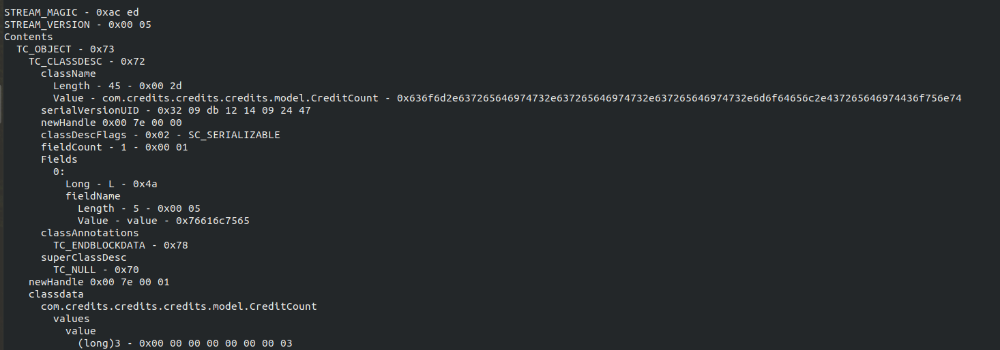
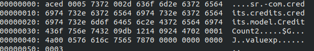

# Too Many Credits 1
Okay, fine, there’s a lot of credit systems. We had to put that guy on break; seriously concerned about that dude.
Anywho. We’ve made an actually secure one now, with Java, not dirty JS this time. Give it a whack?
If you get two thousand million credits again, well, we’ll just have to shut this program down.
Even if you could get the first flag, I bet you can’t pop a shell!
http://toomanycredits.tamuctf.com

# Solution
This challenge is about Java Serialization.

## Understanding the cookie
On visiting the link we see a page with a counter. On inspecting the cookies we see a base64 string as cookie.

On directly decoding it you get gibberish. This is because its not plain text.
The best way to handle such base64 strings is to decode the string and save it into a file. Use a command like
``` echo -n H4sIAAAAAAAAAFvzloG1uIhBNzk/Vy+5KDUls6QYg87NT0nN0XMG85zzS/NKjDhvC4lwqrgzMTB6MbCWJeaUplYUMEAAEwAKMkv7UgAAAA== | base64 -d w0 >> unknown_file
```
Then run file on it to know the actual filetype.
```file unknown_file
```
This is will return saying its a gzip file. On extracting we get another file, applying ``file`` on it gives filetype as Java Serialized Object.
The combined command till here would look like
``` echo -n H4sIAAAAAAAAAFvzloG1uIhBNzk/Vy+5KDUls6QYg87NT0nN0XMG85zzS/NKjDhvC4lwqrgzMTB6MbCWJeaUplYUMEAAEwAKMkv7UgAAAA== | base64 -d | gzip -d >> java_ser_obj
```

## Crafting our payload

So now we know we have to understand how such an Object is structured in order to edit it and increase our credits value
For information about the structure of the object, refer this [article](https://www.javaworld.com/article/2072752/the-java-serialization-algorithm-revealed.html)

To view the deserialized payload, we can [Serialization Dumper](https://github.com/NickstaDB/SerializationDumper) tool by NickstaDB


We can see that it has a field of Long type which holds the credits count. So its obvious that we have to find and edit that to a two thousand million in order to get the flag.
If you read the structure articel you could now anticipate where the value would be in the hexdump and change it appropriately.
Incase you skipped that part, just look for a 3 in the hex and change it.(Its at the very end). We need to add a high hex value there. We can patch that using an online [hex editor](https://hexed.it/?hl=en)
I am attatching the [patched object](patched_object) for reference



After patching it we compress it, base64 encode it and send it as cookie. The entire command to generate payload from the patched object
``` gzip -c patched_object | base64 -
```
This returns the payload string `H4sICBsJe14AA3BhdGNoZWRfb2JqZWN0AFvzloG1uIhBNzk/Vy+5KDUls6QYg87NT0nN0XMG85zz
S/NKjDhvC4lwqrgzMTB6MbCWJeaUplYUMFxgAAEBAAdAMaNSAAAA`
Submit as cookie and get the flag.


# Too Many Credits 2
Even if you could get the first flag, I bet you can't pop a shell!
URL: http://toomanycredits.tamuctf.com
