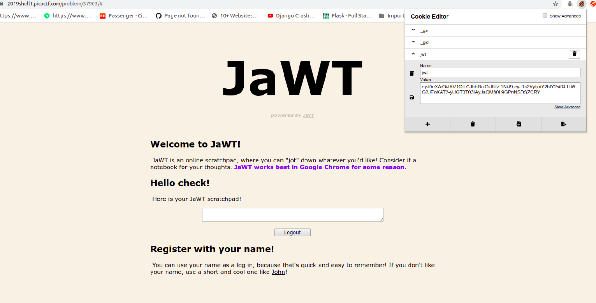
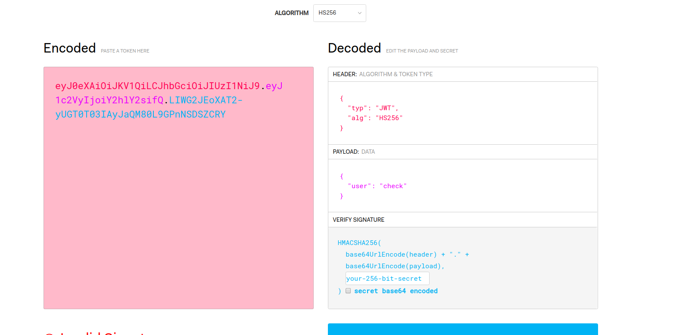
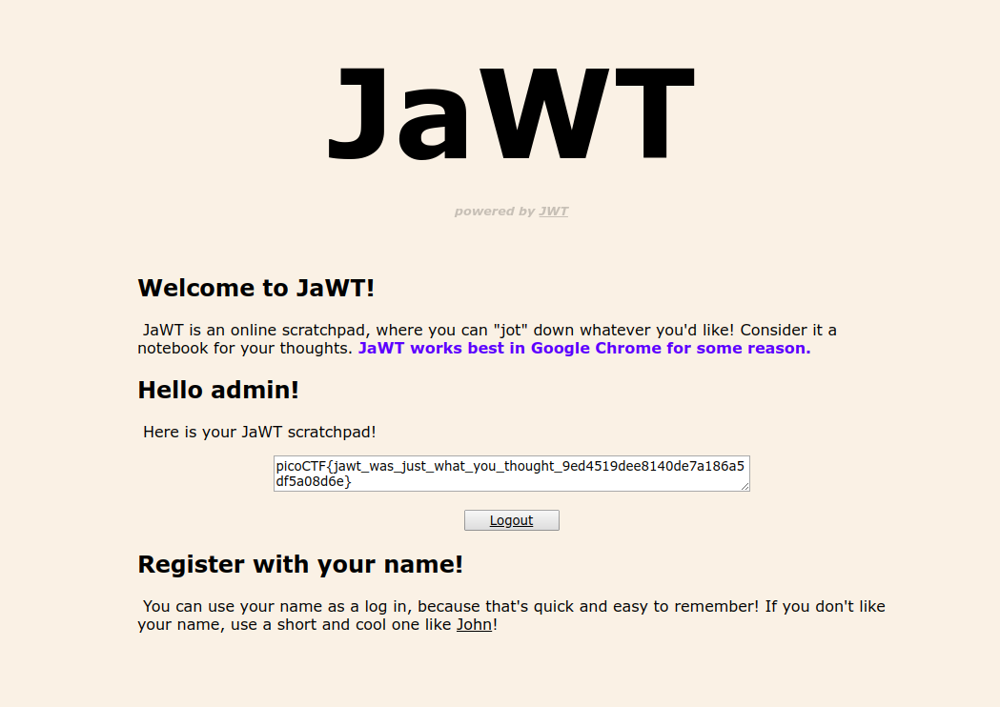

# JaWT Scratchpad
Check the admin scratchpad! https://2019shell1.picoctf.com/problem/37903/ or http://2019shell1.picoctf.com:37903
Hints:
What is that cookie?
Have you heard of JWT?

# Solution
This challenge is about Json Web Tokens. On visiting the link we see a page asking for username. On providing username other than admin we are given a textarea to type in. A new cookie is created named 'jwt'. The username I provided was 'check'



Read about how JWT tokens work from here:
https://blog.angular-university.io/angular-jwt/

The Jwt token in the cookie uses 'HS256' for signing. This means the the header,payload are hashed using SHA-256 after signing with a secret key. The token can be inspected at:
[JWT debugger](https://jwt.io/#debugger).




Here the payload consists of only the user. We have to change the user to admin to access the page and get the flag. But when we change the value without knowing the secret key the signature will change and our jwt token becomes invalid. Hence we need to find the key before we can change the token.


There is a reference to John in the webpage provided giving a clue that we might as well try a dictionary attack on the secret key. The wordlist used for the attack is rockyou.txt (a popular wordlist) because [reasons](https://youtu.be/7jNalVFCY90?t=458).

## Finding the key

### JohnTheRipper
In order to bruteforce the token
Once you have set up [John the Ripper](https://github.com/magnumripper/JohnTheRipper) and downloaded the wordlist
Create a textfile and paste the original JWT into it and save it.
Then run john.
```
john ./picoJWT-textfile.txt --wordlist=./rockyou.txt
```
You will get the secret used: 'ilovepico'

### Python Script
Another way of bruteforcing is using a [JWT Crack Python Script](https://github.com/Sjord/jwtcrack).
  After installing the requirements run it using 
 `python crackjwt.py your_jwt_token_here rockyou.txt`


## Modifying the token
Go back to the [JWT debugger](https://jwt.io/#debugger). Change the user to admin and then update the secret with the found key.
This will give you a new JWT. Change the cookie value to the new JWT and refresh the page and you should see the flag in the textarea.



Flag is picoCTF{jawt_was_just_what_you_thought_9ed4519dee8140de7a186a5df5a08d6e}
